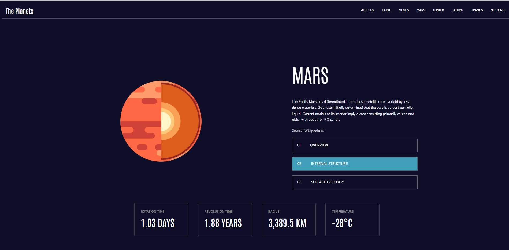
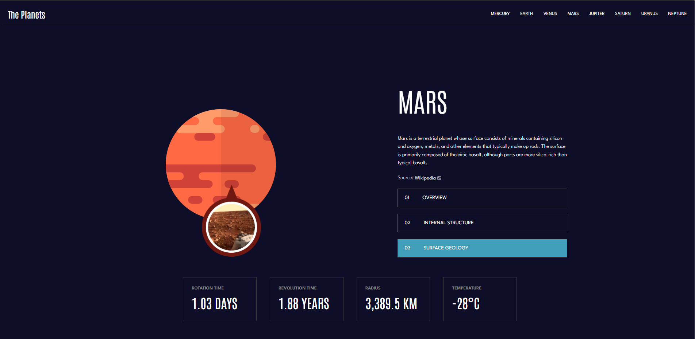
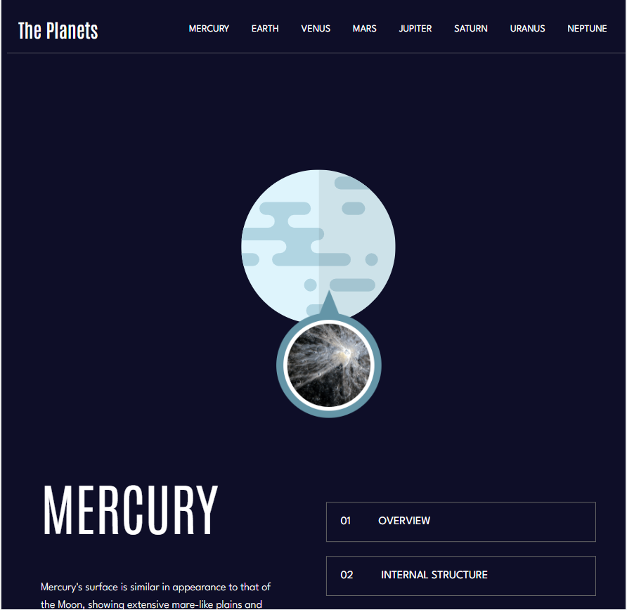

# Planet Facts - built with React

## What I used to build this amazing project

* React
* CSS and HTML

## Get facts about planets with this fun website

## Use it on your desktop, tablet or phone

## Live Version

Please follow this url to run my application: https://roaring-cascaron-bc5620.netlify.app

##  Contact 👋
If you find any issues or you want to share your feedback, please email me at busygina.rita.ca@gmail.com

Thanks for checking out one of my projects

Completed by Margarita Busygina
Ottawa, Canada
June 2022
